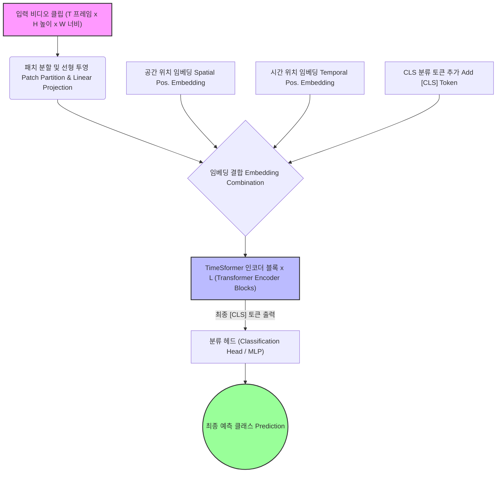

#  TimeSformer

## 1. 한줄 요약
- **TimeSformer는 공간과 시간 어텐션을 분리한 factorized self-attention으로 비디오 토큰의 계산량을 줄인 Transformer 기반 비디오 모델이다.**

## 2. 배경과 문제의식

- 짧은 구간에서 일어나는 세부적인 행동(atomic actions)들이 그 의미를 완전히 명확하게 파악(fully disambiguated)하기 위해서는, 비디오의 나머지 부분과 연관 지어 맥락(contextualized)을 이해해야 한다고 주장
- 따라서 자연어 처리(NLP) 분야에서 사용되는 장거리(long-range) 셀프 어텐션(self-attention) 모델들이 비디오 모델링에도 매우 효과적일 것이라고 예상

- 데이터가 적을땐 CNN의 [[CNN#^0d803b|inductive bias]] 가 유리하지만, 데이터가 큰 상황에선 모델이 스스로 깨우치는 것이 더 똑똑한 모델을 만든다고 주장

- CNN이 정보를 '조각조각 모아서' 이해하는 방식이라면, 자신들의 TimeSformer(Self-Attention)는 시공간 전체를 '한 번에 직접 연결해서' 이해하기 때문에 비디오 인식에 더 유리하다고 주장
	 Filter(kernel)를 사용하여 receptive field를 보는 방식을 통하여 먼 거리에 있는 두 물체 사이의 관계를 파악하려면, Layer를 깊게 쌓아야함
	 좁은 영역의 정보를 계속 뭉쳐서(Aggregation) 넓은 범위를 이해하는 방식은 시, 공간적으로 멀리 떨어진 요소들 간의 관계(Long-range dependencies)를 정확하게 잡아내는 데에 태생적인 한계가 있음

- 비디오는 공간(H×W) + 시간(T)으로 토큰 수가 급격히 증가.
- 순수한 3D self-attention은 $O((THW)^2)$로 비효율적.
- TimeSformer는 **공간/시간 축을 분리**해 계산량을 줄이면서 성능 유지.

## 3. 핵심 아이디어
### 3.1 Factorized Attention
- self-attention을 두 단계로 분리:
  1) **Temporal attention**: 각 공간 위치별로 시간축만 어텐션.
  2) **Spatial attention**: 각 프레임별로 공간축만 어텐션.
- 결과적으로 복잡도는 $O(T^2HW + THW^2)$로 감소.

### 3.2 다양한 분해 방식
- **Divided Space-Time** (기본): temporal → spatial 순차 적용.
- **Space-only**: 시간 정보 없이 각 프레임 독립 처리.
- **Joint**: 공간+시간을 동시에 처리(비교 기준).

## 4. 구성 요소
### 4.1 Input Clip
- 입력 클립 $X\in R^{H\times W\times 3\times F}$
- 겹치지 않는 $P \times P$ 패치 $N$개로 분할($N=HW/P^2$)
- flatten these patches into vectors ($\mathbf{X}_{(p,t)} \in \mathbb{R}^{3P^2}$)
- $p = 1, ..., N$ 공간 위치(spatial location)
- $t = 1, ..., F$ 프레임 인덱스(index over frames)
- **Linear embedding**
	 학습 가능한 행렬 $E \in \mathbb{R}^{D \times 3P^2}$ 을 이용하여 patch $\mathbf{X}_{(p,t)}$ $\rightarrow$ embedding vector $\mathbf{z}^{(0)}_{(p, t)} \in \mathbb{R}^D$ 로 변환
	 $$\mathbf{z}^{(0)}_{(p, t)} = E \mathbf{x}_{(p, t)} + \text{e}^{pos}_{(p, t)}$$
		(0)은 Transformer layer를 통과하기 전인, 가장 초기 단계의 입력값임을 의미
		$D$는 model의 hyper parameter
- **Query-Key-Value computeation**
	 $$\begin{aligned}
q^{(\ell,a)}_{(p,t)} &= W^{(\ell,a)}_Q \text{LN}(z^{(\ell-1)}_{(p,t)}) \\
k^{(\ell,a)}_{(p,t)} &= W^{(\ell,a)}_K \text{LN}(z^{(\ell-1)}_{(p,t)}) \\
v^{(\ell,a)}_{(p,t)} &= W^{(\ell,a)}_V \text{LN}(z^{(\ell-1)}_{(p,t)})
\end{aligned}$$
	$\ell$ = layer index
	$\alpha$ = att head index
- **Self-attention computation**
		 $$\alpha^{(\ell,\alpha)\text{space}}_{(p, t)} = \text{softmax}\left(\frac{\text{q}^{(\ell, \alpha)}}{\sqrt{D_h}} \right)^\top \cdot \left[ k^{(\ell,a)}_{(0,0)}, \{ k^{(\ell,a)}_{(p',t')} \}_{p'=1,\dots,N} \right]$$
	 - Spatial Attention
		 $t' = t$으로 고정하여 나와 같은 시간에 있는 패치들로 Attention 연산 범위를 고정한다.
		 비디오 전체의 패치에 대하여 Attention 연산을 수행하는 Full Spatiotemporal Attention 보다 연산량이 절약된다.
- **Encoding**
$$s^{(\ell,a)}_{(p,t)} = \sum \alpha \cdot v$$
	벡터 $s$는 주변 패치들의 정보를 문맥에 맞게 흡수한 새로운 특징 벡터가 된다.
	$$z'^{(\ell)}_{(p,t)} = W_O [\dots] + z^{(\ell-1)}_{(p,t)}$$
	$W_O$ : 이어 붙인 긴 벡터를 다시 원래 크기($D$)로 섞는 선형 변환 행렬
	$z^{(\ell - 1)}_{(p, t)}$: 잔차 연결
	$$z^{(\ell)}_{(p,t)} = \text{MLP}(\text{LN}(z')) + z'$$
	Attention을 거친 데이터를 MLP에 통과시킴
		데이터에 non-linearity 추가하여 복잡한 특징을 학습하게 함
		잔차 연결을 한번 더 수행
		다음 블록($\ell + 1$)의 입력으로 투입
- **Classification Embedding**
	$$y = \text{LN}(z^{(L)}_{(0,0)})$$
	 모든 transformer block($L$개)을 다 통과한 후, 마지막 단계에서 발생
	 
	 단 하나의 벡터 $(0, 0)$토큰이 비디오 전체의 요약본 역할을 하며, 이를 이용하여 정답 예측
- **Space-Time Self-Attention**
	 표준적인 시공간 주의 집중 방식은 모든 패치 쌍에 대해 유사도를 계산하므로 비용이 많이 듭니다. 이를 해결하기 위해 소스에서는 여러 효율적인 설계 방식을 비교했습니다:
		
	 **공간 주의 집중(Space Attention, S):** 동일한 프레임 내의 다른 패치들과만 상호작용함. 다른 시간대(프레임)의 패치와는 정보를 교환하지 않음. ViT와 가장 유사하지만, 시간적인 정보를 직접적으로 모델링하지 못함
	 **결합 시공간 주의 집중(Joint space-Time Attention, ST):** 쿼리 패치가 모든 프레임의 모든 패치와 상호작용함. 이론적으로 가장 풍부한 정보를 얻을 수 있지만, 연산량이 매우 높음
	 **분할 시공간 주의 집중(Divided Space-Time Attention, T+S):** 이 논문에서 가장 우수한 성능을 보인다고 언급한 방식. 각 블록 내에서 **시간적 주의 집중과 공간적 주의 집중을 순차적으로 별도 적용**하는 방식. Time attention을 통해 쿼리 패치는 다른 프레임의 동일한 공간 위치에 있는 패치들만 보고, 그 후, Space Attention을 통해 동일한 프레임 내의 다른 패치들과 상호작용함. 패치당 비교 횟수를 $NF+1$에서 $N+F+2$로 크게 줄여줍니다. 이는 조인트(Joint) 방식보다 연산량이 적고, 유사한 수준의 문맥 파악이 가능함. 
	 **희소 국소 전역 주의 집중(Sparse Local Global, L+G):** 인접한 패치들에 대한 국소적 주의 집중과 스트라이드(stride)를 이용한 희소한 전역 주의 집중을 결합한 방식입니다. $F \times H/2 \times W/2$패치들과 상호작용하여 Local 정보를 얻고, stride 2를 적용하여 프레임을 건너 뛰며 Global 정보를 얻음
	 **축주의 집중(Axial Attention, T+W+H):** 주의 집중 계산을 시간, 너비, 높이의 세 가지 독립된 단계로 분해하여 수행합니다
	 프레임 간 같은 위치에 대하여 attention, 패치 간 같은 행에  대하여 attention, 패치 간 같은 열에 대하여 attention
	
	 **실험 결과:** 이 중 **분할 시공간 주의 집중(T+S)** 방식이 Kinetics-400(K400) 및 Something-Something-V2(SSv2) 데이터셋 모두에서 **가장 높은 분류 정확도**를 기록했습니다.

###  3D CNN과의 비교 및 분석

- **모델 용량 및 효율성:** TimeSformer는 매개변수(121.4M)가 많음에도 불구하고, SlowFast나 I3D 같은 **3D CNN 모델보다 추론 비용(TFLOPs)이 낮고 훈련 속도가 훨씬 빠릅니다**.
- **데이터 규모의 영향:** K400에서는 모든 데이터 규모에서 타 모델을 압도했지만, 복잡한 시간적 추론이 필요한 **SSv2에서는 학습 데이터가 충분할 때(75% 이상)만 다른 모델보다 뛰어난 성능**을 보였습니다.
- **토큰 수의 확장:** 공간 해상도를 높이거나 입력 프레임 수를 늘릴수록 성능이 지속적으로 향상되었으며, GPU 메모리 한계 내에서 **최대 96프레임(약 12초)까지 처리**할 수 있었습니다.

### 사전 학습 및 위치 임베딩의 중요성

- **사전 학습(Pretraining):** 모델의 파라미터가 많기 때문에 ImageNet을 통한 사전 학습이 필수적입니다. 특히 **ImageNet-21K 사전 학습은 K400 성능 향상에 큰 도움**이 되었습니다.
- **위치 임베딩(Positional Embedding):** 공간 전용 임베딩보다 **시공간(Space-Time) 위치 임베딩을 사용할 때 가장 높은 정확도**를 얻었으며, 이는 시간적 추론이 중요한 데이터셋에서 특히 두드러졌습니다.

### 최첨단(SOTA) 성능 및 장기 비디오 모델링

- **벤치마크 결과:** TimeSformer는 **Kinetics-400 및 Kinetics-600에서 최첨단 결과**를 달성했습니다. SSv2에서는 최고 수준은 아니었으나 유망한 성능을 보였고, Diving-48에서는 SlowFast를 큰 차이로 앞질렀습니다.
- **장기 비디오 모델링(Long-Term Video Modeling):** 평균 7분 길이의 **HowTo100M** 데이터셋 실험에서, TimeSformer는 동일한 조건의 SlowFast보다 **8~11% 더 높은 정확도**를 기록하며 장기 의존성 학습에 매우 적합함을 증명했습니다.

### 질적 분석 및 결론

- **주의 집중 시각화:** 모델은 복잡한 시공간 추론을 수행하기 위해 **비디오 내에서 의미 있게 중요한 영역(예: 손이나 물체)에 집중**하는 법을 스스로 학습함을 확인했습니다.
- **결론:** TimeSformer는 컨볼루션 없이 **자기주의 집중만으로 구축된 효과적이고 확장 가능한 비디오 아키텍처**입니다. 이 방식은 개념적으로 간단하고 훈련/추론 비용이 낮으며, 1분 이상의 긴 클립에도 적용 가능하여 향후 다양한 비디오 분석 작업으로의 확장이 기대됩니다.
### 4.2 TimeSformer 블록
- LayerNorm → Temporal MHSA → Spatial MHSA → MLP
- Residual 연결 포함.
- 클래스 토큰은 공간/시간 어텐션에 참여.

## 5. 수식(요약)
- 입력 토큰 $X \in \mathbb{R}^{(T \cdot N) \times d}$, $N$은 프레임당 패치 수.
- Temporal attention(공간 위치 고정):
  - 각 위치 $i$에 대해 $X_i \in \mathbb{R}^{T \times d}$에 대해 MHSA 수행.
- Spatial attention(시간 고정):
  - 각 시간 $t$에 대해 $X_t \in \mathbb{R}^{N \times d}$에 대해 MHSA 수행.

## 6. 장점과 한계
### 장점
- 비디오 토큰 수 증가에도 **연산 효율** 유지.
- 시간/공간 정보를 분리해 **학습 안정성** 개선.
- ViT 기반 백본으로 쉽게 확장 가능.

### 한계
- 분리된 어텐션이 **공간-시간 상호작용을 완전히 포착하지 못할 수 있음**.
- 긴 시퀀스에서는 여전히 연산량 증가.

## 7. 적용 분야
- 비디오 분류
- 행동 인식
- 비디오 이해 전반

## 8. 관련 개념
- [[Transformer]]
- [[Self-Attention]]
- [[Multi-Head Attention]]
- [[Vision Transformer]]

## 9. 참고 문헌
- Bertasius, G., Wang, H., Torresani, L. (2021). *Is Space-Time Attention All You Need for Video Understanding?* https://arxiv.org/abs/2102.05095
