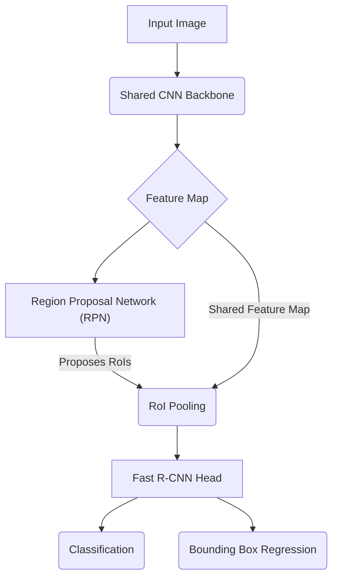

---
tags:
  - MILAB
  - ComputerVision
  - ObjectDetection
  - R-CNNFamily
---

# Faster R-CNN

## 1. 개요 (Overview)

| 항목 | 내용 |
| --- | --- |
| **이름** | **Faster R-CNN: Towards Real-Time Object Detection with Region Proposal Networks** |
| **발표** | NIPS 2015 |
| **제안자** | Shaoqing Ren, Kaiming He, Ross Girshick, Jian Sun (Microsoft Research) |
| **핵심** | **Region Proposal Network (RPN)**를 도입하여, 객체 탐지 파이프라인을 **최초의 완전한 단일 End-to-End 네트워크**로 통합. |

---

## 2. 기존 문제점: Fast R-CNN의 병목

[[40_Papers/Detection Essentials/Fast R-CNN|Fast R-CNN]]은 RoI Pooling을 통해 네트워크의 추론 속도를 크게 향상시켰지만, 전체 프로세스는 여전히 **후보 영역 생성(Region Proposal)** 단계에 발목이 잡혀있었습니다.

- **외부 알고리즘 의존**: 후보 영역 생성을 위해 **Selective Search**와 같은 외부 알고리즘을 사용.
- **CPU 병목**: Selective Search는 CPU에서 동작하며 이미지 한 장당 약 2초가 소요되어, GPU의 빠른 연산 속도를 무의미하게 만드는 **명백한 병목(bottleneck)**이었습니다.

> **질문**: "왜 GPU로 빠르게 피쳐를 뽑아놓고, 후보 영역은 CPU에서 느리게 찾는가? 후보 영역 탐색 또한 네트워크가 할 수는 없을까?"

---

## 3. 핵심 아이디어: Region Proposal Network (RPN)

Faster R-CNN은 위 질문에 대한 해답으로 **Region Proposal Network (RPN)** 를 제안합니다.

> **RPN**은 [[CNN]] 피쳐맵을 입력받아, **객체가 있을만한 위치와 크기를 직접 제안하는 작은 신경망**입니다. 이를 통해 후보 영역 생성 과정을 전체 탐지 네트워크의 일부로 통합했습니다.

- **주요 특징**:
    1.  **피쳐맵 공유**: RPN은 객체 탐지를 위한 주 네트워크(Fast R-CNN)와 **컨볼루션 피쳐맵을 공유**합니다. 이로써 후보 영역 생성을 위한 추가적인 연산 비용이 매우 적습니다.
    2.  **완전한 End-to-End**: 후보 영역 생성부터 최종 분류 및 회귀까지, 모든 과정이 **하나의 네트워크 안에서 미분 가능**하게 되어 진정한 End-to-End 학습이 가능해졌습니다.

---

## 4. 전체 아키텍처

Faster R-CNN은 크게 두 가지 모듈로 구성됩니다.

1.  **RPN**: 후보 영역(RoI)을 생성하는 모듈.
2.  **Fast R-CNN Detector**: RPN이 생성한 RoI를 받아 클래스를 분류하고 위치를 정교하게 보정하는 모듈.

> **Input Image**: 원본 이미지가 네트워크에 입력됩니다.

> **Shared CNN Backbone** : VGG나 ResNet과 같은 CNN Backbone 네트워크가 이미지의 주요 특징(Feature)을 추출합니다. 이 Backbone은 RPN과 Fast R-CNN Head가 공유합니다.

> **Feature Map**: CNN을 통과하여 생성된 최종 컨볼루션 피쳐맵입니다.

> **Region Proposal Network (RPN)**: 피쳐맵을 입력받아 객체가 있을 만한 후보 영역(RoI)을 제안합니다.

> **RoI Pooling**: RPN이 제안한 RoI와 공유된 피쳐맵을 사용하여, 각 RoI로부터 고정된 크기의 특징 벡터를 추출합니다.

> **Fast R-CNN Head**: RoI Pooling을 거친 특징 벡터를 입력받아 최종 예측을 수행하는 부분입니다.

 > **Classification**: 해당 RoI가 어떤 객체 클래스에 속하는지 분류합니다.
 
 > **Bounding Box Regression**: RoI의 위치를 더 정확하게 보정합니다.
 
 ---
 
### 4.1. RPN 상세 구조

RPN은 공유된 마지막 컨볼루션 피쳐맵 위에서 작동합니다.

1.  **Intermediate Layer**: 먼저 피쳐맵 위를 **3x3 컨볼루션**으로 슬라이딩하며 더 넓은 receptive field를 갖는 중간 피쳐맵을 생성합니다. (논문에서는 256-d)
2.  **두 개의 형제(sibling) 레이어**:
	    - **분류 레이어 (cls layer)**: 1x1 컨볼루션으로, 각 위치의 k개 [[Anchor Boxes|앵커 박스]]에 대해 **객체인지 배경인지(Objectness Score)** 를 예측합니다. (출력 채널: 2k)
    - **회귀 레이어 (reg layer)**: 1x1 컨볼루션으로, 각 위치의 k개 앵커 박스를 실제 객체에 맞추기 위한 **좌표 보정값**을 예측합니다. (출력 채널: 4k)

### 4.2. 앵커 (Anchors)

RPN은 미리 정의된 다양한 크기와 비율의 기준 박스인 **[[Anchor Boxes|앵커 박스]]** 를 사용하여 객체 후보를 효율적으로 찾습니다. 자세한 내용은 해당 노트를 참조하세요.

---

## 5. 학습 과정

### 5.1. RPN의 손실 함수

RPN은 각 앵커에 대해 분류와 회귀를 동시에 학습하므로 **Multi-task Loss**를 사용합니다.

$$ L(\{p_i\}, \{t_i\}) = \frac{1}{N_{\text{cls}}} \sum_i L_{\text{cls}}(p_i, p_i^*) + \lambda \frac{1}{N_{\text{reg}}} \sum_i p_i^* L_{\text{reg}}(t_i, t_i^*) $$

> - $i$: 미니배치 내의 앵커 인덱스
> - $p_i$: 앵커 $i$가 객체일 확률 (예측값)
> - $p_i^*$: 실제 정답 레이블 (객체이면 1, 배경이면 0)
> - $t_i$: 예측된 경계 상자 좌표 보정값 (4개의 파라미터)
> - $t_i^*$: 실제 정답 경계 상자 좌표 보정값
> - $L_{\text{cls}}$: **분류 손실 (Log Loss)**. 두 클래스(객체/배경)에 대한 Cross-Entropy.
> - $L_{\text{reg}}$: **회귀 손실 (Smooth L1 Loss)**. $p_i^*$ 항에 의해 **positive 앵커($p_i^*=1$)에 대해서만 활성화**됩니다.
> - $N_{\text{cls}}, N_{\text{reg}}$: **정규화(Normalization) 항**. 각각 미니배치 크기(e.g., 256)와 앵커의 총 개수(e.g., ~2400)로 나누어 두 손실의 균형을 맞춥니다.
> - $\lambda$: 가중치 파라미터 (논문에서는 10으로 설정하여 두 손실의 중요도를 비슷하게 맞춤).

### 5.2. 4-단계 교대 학습 (4-Step Alternating Training)

RPN과 Fast R-CNN Detector는 컨볼루션 레이어를 공유하지만, 각자 다른 방식으로 가중치를 업데이트하기 때문에 한번에 학습시키기 어렵습니다. 따라서 논문에서는 다음과 같은 4단계 교대 학습법을 제안했습니다.

1.  **1단계 (RPN 학습)**: ImageNet으로 사전학습된 모델을 불러와, RPN 학습을 위해 fine-tuning 합니다.
2.  **2단계 (Fast R-CNN 학습)**: 1단계에서 학습된 RPN이 생성한 후보 영역들을 사용하여, 별도의 Fast R-CNN Detector를 학습시킵니다. 이 때 CNN 가중치는 다시 ImageNet 사전학습 모델로 초기화됩니다.
3.  **3단계 (RPN 재학습)**: 이제 Detector에 의해 fine-tuning된 CNN 가중치를 고정(freeze)하고, 이 공유된 CNN 위에서 RPN의 고유 레이어들만 다시 fine-tuning 합니다.
4.  **4단계 (Fast R-CNN 재학습)**: 공유된 CNN과 RPN을 고정하고, Fast R-CNN의 고유 레이어들만 다시 fine-tuning 합니다.

> 현재는 이 복잡한 방식 대신, 두 손실을 합쳐 전체 네트워크를 한 번에 학습시키는 **근사적 공동 학습(Approximate Joint Training)** 방식이 주로 사용됩니다.

---

## 6. 성능 및 의의

- **실시간 수준의 객체 탐지**: Selective Search 병목을 제거함으로써, **전체 프레임 속도를 5fps (VGG16 기준)** 까지 끌어올려 실시간 탐지의 가능성을 열었습니다.
- **정확도 향상**: RPN이 데이터로부터 학습된 후보 영역을 제안하므로, Fast R-CNN보다 더 높은 mAP(PASCAL VOC 2007에서 73.2%)를 달성했습니다.
- **최초의 단일 통합 네트워크**: 후보 영역 생성부터 최종 탐지까지 모든 구성요소가 하나의 CNN으로 통합된 최초의 모델입니다.

---

## 7. 관련 노트

- **이전 모델**: [[R-CNN]], [[SPPNet]], [[30_Architectures/ObjectDetection/Fast R-CNN|Fast R-CNN]]
- **핵심 개념**: [[Anchor Boxes]], [[Bounding box regression]]
- **후속 모델**: [[Mask R-CNN]], [[Feature Pyramid Network|Feature Pyramid Network (FPN)]]
