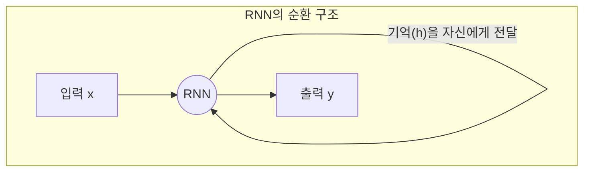
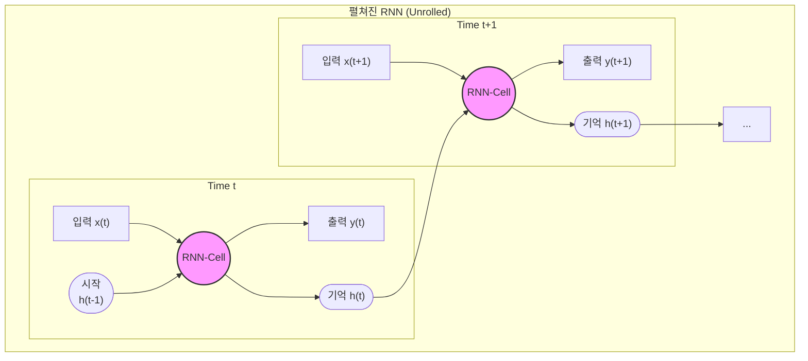
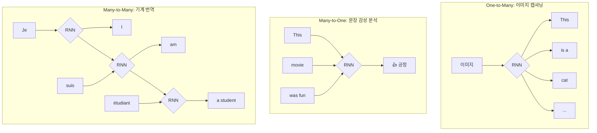
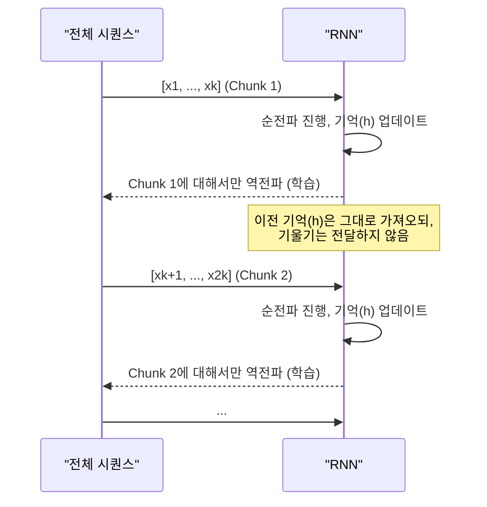
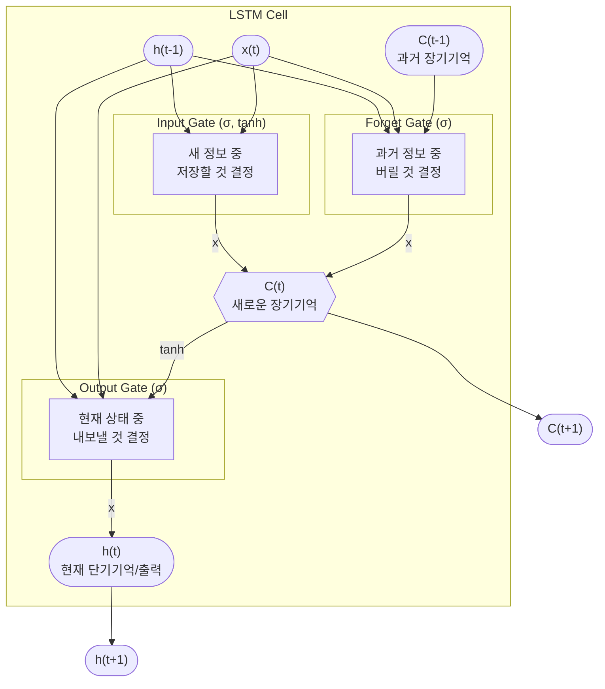

 
## 序: 순서가 있는 데이터, 어떻게 처리할까?

지금까지 우리는 주로 정적인 데이터, 즉 **고정된 크기의 이미지 한 장**을 보고 "이것은 고양이다"라고 판단하는 신경망(CNN 등)에 집중했습니다.

하지만 세상의 많은 데이터는 **순서와 흐름**을 가집니다.

- **문장**: "나는", "밥을", "먹는다" (단어의 순서가 중요)
- **음악**: 시간에 따라 흐르는 멜로디
- **영상**: 프레임의 연속적인 흐름

이런 데이터를 **시퀀스(Sequence) 데이터**라고 부릅니다. 일반적인 신경망은 이전에 들어온 데이터를 기억하지 못하기 때문에 시퀀스를 처리하기 어렵습니다. "먹는다"라는 단어를 처리할 때 "나는"과 "밥을"이라는 บริบท을 잊어버리는 것과 같습니다.

이 문제를 해결하기 위해 등장한 것이 바로 **Recurrent Neural Network (RNN)**, 즉 순환 신경망입니다. RNN은 **"기억"**을 가진 신경망이라고 생각할 수 있습니다.

---

## 1. RNN의 핵심: 기억의 고리

RNN의 핵심 아이디어는 간단합니다. "이전 단계의 처리 결과를 다음 단계의 입력으로 함께 사용하자."

이전의 정보를 담고 있는 '기억'을 **Hidden State(은닉 상태, $h$)** 라고 부릅니다.

- **t 시점의 RNN은:**
    1.  **t 시점의 입력 데이터($x_t$)** 를 받습니다.
    2.  **t-1 시점의 기억($h_{t-1}$)** 을 함께 입력으로 받습니다.
    3.  이 두 정보를 조합하여 **t 시점의 결과($y_t$)** 를 만들고, **t 시점의 새로운 기억($h_t$)** 을 업데이트합니다.
    4.  이 새로운 기억 $h_t$는 다음 시점인 t+1로 전달됩니다.

이 과정을 시각화하면 다음과 같습니다. 마치 기억($h$)이 고리처럼 연결되어 순환하는 모습입니다.

이 순환 구조를 시간의 흐름에 따라 펼쳐보면(Unrolling) RNN이 어떻게 시퀀스를 처리하는지 더 명확하게 볼 수 있습니다.

> **핵심**: 위 그림의 모든 **RNN Cell은 사실 동일한 하나의 신경망**입니다. 같은 파라미터(가중치)를 모든 타임스텝에서 공유하며 사용합니다. 이 덕분에 시퀀스의 길이가 달라져도 처리할 수 있습니다.

### 파라미터 공유: 하나의 규칙으로 모든 것을 처리하다

"모든 RNN Cell이 동일한 신경망"이라는 것은, 모든 타임스텝(state)에서 **완전히 동일한 가중치(Weight)와 편향(Bias)을 공유하며 사용한다**는 의미입니다.

RNN의 hidden state를 업데이트하는 수식은 다음과 같습니다.
$$h_t = \tanh(W_{hh} h_{t-1} + W_{xh} x_t + b)$$

여기서:
- **$W_{xh}$**: 현재 입력($x_t$)을 hidden state로 변환하는 가중치
- **$W_{hh}$**: 이전 hidden state($h_{t-1}$)를 다음 hidden state로 변환하는 가중치
- **$b$**: 편향(bias)

이 $W_{xh}$, $W_{hh}$, $b$ 라는 **단 한 세트의 파라미터**가 시퀀스의 길이와 상관없이 모든 타임스텝 $t=1, 2, 3, \dots$ 에서 계속 재사용됩니다.

이러한 **파라미터 공유(Parameter Sharing)** 방식은 다음과 같은 매우 중요한 장점을 가집니다.

1.  **가변 길이 시퀀스 처리**: 만약 각 타임스텝마다 다른 가중치를 사용한다면, 모델은 정해진 길이의 시퀀스만 처리할 수 있을 것입니다. 가중치를 공유하기 때문에 시퀀스가 10개든 100개든 상관없이 동일한 규칙을 적용하여 처리할 수 있습니다.
2.  **학습 효율성 및 일반화**: 문장에서 특정 패턴(예: 주어 다음에 동사가 오는 패턴)은 문장의 어느 위치에나 나타날 수 있습니다. 모든 타임스텝에서 같은 가중치를 사용함으로써, RNN은 시간에 따라 변하지 않는 보편적인 패턴을 학습할 수 있습니다.
3.  **적은 파라미터 수**: 학습해야 할 파라미터의 수가 시퀀스 길이에 비례하지 않고 고정되어 있어 훨씬 효율적이고 과적합(overfitting)을 피하기 쉽습니다.

결론적으로, **"하나의 규칙(가중치)을 배워서 모든 상황(타임스텝)에 적용하는 것"** 이 RNN의 핵심 작동 원리입니다.

---

## 2. RNN으로 풀 수 있는 문제들

RNN은 입출력의 형태에 따라 다양한 시퀀스 문제를 해결할 수 있습니다.

---

## 3. RNN의 학습: 시간을 거슬러 전파하라 (BPTT)

RNN은 어떻게 학습할까요? **BPTT(Backpropagation Through Time)**라는 방법을 사용합니다.

1.  전체 시퀀스를 RNN에 입력하여 각 타임스텝별로 예측값과 실제값의 차이(Loss)를 계산합니다.
2.  이 Loss들을 모두 합산합니다.
3.  마지막 타임스텝부터 시작하여, **시간의 역방향으로** 기울기(Gradient)를 전달하며 각 RNN Cell이 공유하는 파라미터를 업데이트합니다.

하지만 시퀀스가 매우 길어지면 (예: 긴 문단, 장편 소설) 문제가 발생합니다.

- **메모리 문제**: 전체 시퀀스의 중간 계산 결과를 모두 저장해야 해서 메모리가 터질 수 있습니다.
- **기울기 문제**: 너무 여러 단계를 거치면 기울기가 0에 가깝게 사라지거나(Vanishing), 무한대로 폭발(Exploding)할 수 있습니다.

### 해결책: Truncated BPTT (잘라서 학습하기)

긴 시퀀스를 한 번에 처리하는 대신, 적절한 길이의 **덩어리(Chunk)**로 잘라서 학습합니다.

---

## 4. RNN의 치명적 단점과 구원자, LSTM

기본 RNN(Vanilla RNN)은 이론적으로는 멋지지만, 실제로는 **장기 기억 상실** 문제를 겪습니다.

> **Vanishing Gradient (기울기 소실) 문제**
> BPTT 과정에서 기울기는 여러 타임스텝을 거치며 계속 곱해집니다. 이 값이 1보다 작으면 (주로 tanh 활성화 함수의 미분값 때문에) 계속 곱해지다가 0에 수렴합니다. 이는 마치 "안녕하세요 저는 한국에서 온..." 처럼 문장이 길어질 때, RNN이 맨 앞의 "안녕하세요"라는 중요한 정보를 잊어버리는 것과 같습니다. 즉, **먼 과거의 정보가 현재까지 전달되지 못하는** 문제입니다.

이 문제를 해결하기 위해 등장한 것이 **LSTM(Long Short-Term Memory)**입니다.

### LSTM의 핵심: 똑똑한 기억 관리 시스템

LSTM은 RNN Cell 내부에 복잡하고 정교한 장치를 추가하여 기억을 효과적으로 관리합니다. 기본 RNN이 그냥 기억을 업데이트하는 방식이라면, LSTM은 **"무엇을, 언제, 얼마나"** 기억할지 결정합니다.

LSTM Cell은 3개의 **게이트(Gate)**와 **Cell State**라는 중요한 요소를 가집니다.

- **Cell State ($C_t$)**: 일종의 '장기 기억' 컨베이어 벨트. 정보가 거의 변하지 않고 쭉 흘러갈 수 있는 고속도로입니다. 기울기 소실 문제를 해결하는 핵심입니다.
- **Forget Gate**: 과거의 정보($C_{t-1}$) 중 **무엇을 잊어버릴지** 결정합니다. (예: 문장의 주어가 바뀌면 이전 주어는 잊는다)
- **Input Gate**: 현재 정보($x_t, h_{t-1}$) 중 **무엇을 새로 기억할지** 결정합니다.
- **Output Gate**: Cell State($C_t$)에 있는 정보 중 **무엇을 현재의 결과($h_t$)로 내보낼지** 결정합니다.

*   σ(시그모이드)는 0~1 사이 값을 출력하여 게이트를 얼마나 열지(정보를 얼마나 통과시킬지) 조절합니다.
*   'x'는 원소별 곱셈(element-wise product)을 의미합니다.

이런 구조 덕분에 LSTM은 오래전의 정보도 필요하다면 잘 보존하고, 불필요한 정보는 잊어버릴 수 있어 RNN의 장기 의존성 문제를 효과적으로 해결했습니다.

---

## 5. 요약 및 최신 동향

- **RNN**: 순서가 있는 데이터를 처리하기 위한 신경망. **Hidden State**를 통해 과거 정보를 기억한다.
- **한계**: **기울기 소실(Vanishing Gradient)** 문제로 인해 장기 기억에 취약하다.
- **LSTM**: RNN의 한계를 극복하기 위해 등장. **Cell State**와 **3개의 게이트(Forget, Input, Output)**를 이용해 기억을 효과적으로 제어한다.
- **최신 동향**: Transformer 모델이 시퀀스 처리의 대세가 되었지만, 매우 긴 시퀀스에 대해서는 계산량이 많다는 단점이 있습니다. 이 때문에 최근에는 RNN/LSTM의 아이디어를 되살린 Mamba, RWKV 같은 새로운 아키텍처들이 다시 주목받고 있습니다.

이 강의는 고정된 데이터에서 순서가 있는 데이터로 신경망의 패러다임을 확장하고, 그 과정에서 마주친 문제(장기 기억)와 이를 해결하기 위한 창의적인 아이디어(LSTM)의 흐름을 이해하는 데 큰 의미가 있습니다.