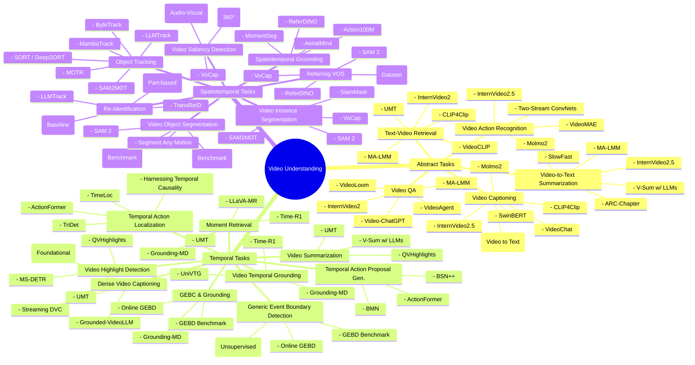

지금 상황을 “현실 제약 + 강점 + 시장성”으로 분해하면, 충돌하는 욕구가 동시에 존재하는 게 정상입니다. 그리고 그 충돌은 풀 수 있는 형태입니다. 다만 “무엇을 하느냐”보다 **어떻게 포장/축소/확장해서 커리어 자산으로 바꾸느냐**가 더 중요합니다.

---

## **1) 현재 상태를 객관식으로 정리하면**

  

### **(A) 보유 자산**

- **도메인 이해가 깊음**: 스포츠 현장에서 실제로 “병목이 뭔지” 알고 있음(등번호, 이벤트 라벨링, 자세 피드백).
    
- **데이터의 더러움/현실성 경험**: 가림, 저해상도, 카메라 각도 변동, 작업 시간 압박 같은 “현업 문제”를 이미 겪음.
    
- **문제 정의 능력의 원천**: 연구에서 가장 비싼 게 문제 정의인데, 그 원천이 있음.
    

  

### **(B) 제약 조건**

- 시간/비용 측면에서 **장기 박사 루트는 리스크가 큼**.
    
- “스포츠 CV”를 그대로 좁게 파면 **시장 풀(pool)이 좁아짐**(국내 기준 특히).
    

  

### **(C) 지금 느끼는 갈등의 정체**

- 하고 싶은 것: 현장 프로세스를 더 정확/빠르게 만들기
    
- 필요한 것: 취업 확률이 높은 범용 역량 증명
    
    → 둘이 싸우는 게 아니라, **같은 문제를 ‘범용 문제’로 재정의**하면 동시에 만족시킬 수 있음.
    

---

## **2) “마이너 도메인”을 “메이저 문제”로 바꾸는 변환 규칙**

  

스포츠는 도메인일 뿐이고, 그 안의 핵심 과제는 시장에서 큰 범주로 이미 존재합니다.

- 등번호 확인 / 식별 병목
    
    → **Video Object Tracking + Re-ID + OCR(텍스트 인식) + Uncertainty estimation**
    
- 이벤트 라벨링
    
    → **Temporal action localization / event detection / video understanding**
    
- 자세 촬영 기반 코칭(휴리스틱)
    
    → **Human pose estimation + 3D/2D kinematics + feedback generation(정량 피드백)**
    

  

이 3개는 스포츠 밖에서도:

- 공장/물류(작업자 안전 자세, 객체 추적)
    
- 리테일/보안(인물/차량 Re-ID)
    
- 문서/미디어(자막/텍스트 인식, 비디오 분석)
    
- 헬스케어/피트니스(자세/동작 평가)
    
    같은 곳으로 확장이 됩니다.
    

  

즉 “스포츠 CV”가 마이너가 아니라, **스포츠는 강한 데모 환경**이고, 네가 파는 기술은 메이저입니다.

---

## **3) 너의 상황에서 가장 합리적인 전략(취업 확률 기준)**

  

### **핵심 원칙: “도메인은 스포츠, 기술 스택은 범용”**

- 논문/프로젝트를 스포츠 데이터로 하되,
    
- 제목/기여/실험 설계를 **범용 태스크 언어**로 씁니다.
    

  

예시)

- “축구 등번호 인식”이 아니라
    
    → “Occlusion-robust video text recognition with uncertainty-driven temporal aggregation”
    
- “축구 이벤트 라벨링”이 아니라
    
    → “Weakly-supervised temporal event detection under noisy labels”
    
- “원반 자세 코칭”이 아니라
    
    → “Pose-based technique assessment with interpretable kinematic features”
    

  

이렇게 쓰면 스포츠가 ‘특수 사례’가 아니라 ‘고난도 벤치마크’로 바뀝니다.

---

## **4) 현실적인 판단: 지금 네가 처한 상황은 “나쁘지 않다”**

  

기계적으로 말하면:

- **리스크**: 도메인에 매몰되면 채용 시장이 좁아질 수 있음.
    
- **기회**: 도메인 문제 자체가 “데이터가 더럽고 어려운” 유형이라, 잘 풀면 실력이 강하게 증명됨.
    
- **승부처**: 박사/교수 루트가 아니라도, “연구형 엔지니어/Applied Scientist/ML Engineer(CV)”로 가는 데 필요한 포트폴리오를 만들 수 있는 배경임.
    

  

즉, 지금 불안한 건 “방향이 없다”기보다, **방향이 2개라서 선택이 어려운 상태**입니다. 이건 최적화 문제로 풀 수 있습니다.

---

## **5) 추천하는 선택지 2개 (너 상황에 맞는 우선순위)**

  

### **선택지 A: 취업 최우선 트랙(가장 안전)**

- 범용성 큰 축 하나를 메인으로 잡기:
    
    1. OCR/문서이해(테이블/레이아웃) 또는
        
    2. Tracking/Re-ID 또는
        
    3. Video event detection
        
    
- 스포츠는 “데모/사이드”로 유지
    

  

장점: 채용 공고와 바로 매칭됨.

단점: 네가 원한 “현장 프로세스 혁신” 서사가 약해질 수 있음(포장으로 해결 가능).

  

### **선택지 B: 도메인 임팩트 트랙(하지만 범용 태스크 언어 유지)**

- “스포츠 workflow 자동화”를 메인 스토리로 유지하되,
    
- 논문/프로젝트는 **범용 과제 2개를 묶어서** 강한 시스템으로 만들기
    

  

예:

- (Tracking/Re-ID) + (Jersey OCR 불확실성 집계) + (이벤트 구간 탐지)
    
    → “라벨링 시간을 몇 배 줄이는 파이프라인”
    
    이건 제품 관점에서도 설득력이 큽니다.
    

---

## **6) 지금 당장 필요한 건 “한 문장 목표” 하나**

  

너한테 맞는 형태는 이겁니다:

- **“현장 비디오 분석의 병목(식별/라벨링/피드백)을 CV로 자동화하는데, 연구 기여는 범용 태스크(OCR/Tracking/Event)로 만든다.”**
    

  

이 문장이 있으면, 하고 싶은 것과 취업 가능성이 같은 방향이 됩니다.

---

원하면, 네 상황에 맞게 **1) 취업 직무 타깃(비전 엔지니어/리서치/MLops 등) 2) 네가 이미 가진 프로젝트(예: OCR/퀴즈/비디오) 3) 남은 학기/시간**을 가정해서, “한 학기 단위 로드맵(논문/프로젝트/깃허브 산출물/포트폴리오 문장)”을 바로 짜줄 수 있습니다.

