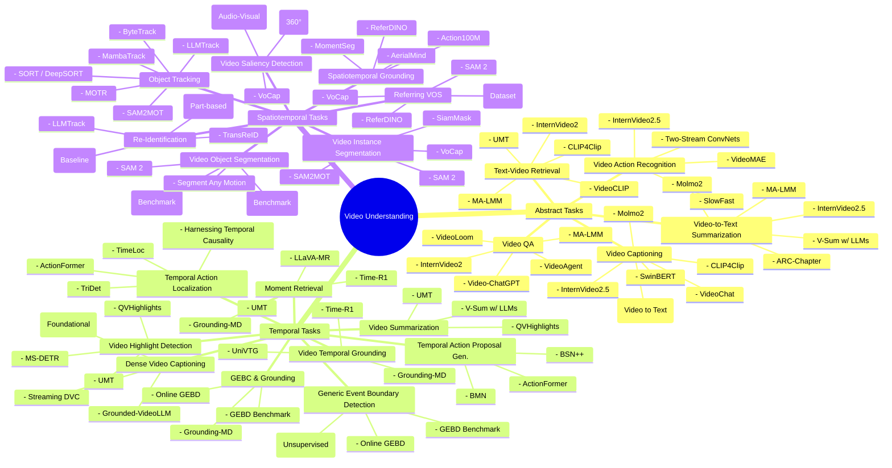

지금 상황을 “현실 제약 + 강점 + 시장성”으로 분해하면, 충돌하는 욕구가 동시에 존재하는 게 정상입니다. 그리고 그 충돌은 풀 수 있는 형태입니다. 다만 “무엇을 하느냐”보다 **어떻게 포장/축소/확장해서 커리어 자산으로 바꾸느냐**가 더 중요합니다.

---

## **1) 현재 상태를 객관식으로 정리하면**

  

### **(A) 보유 자산**

- **도메인 이해가 깊음**: 스포츠 현장에서 실제로 “병목이 뭔지” 알고 있음(등번호, 이벤트 라벨링, 자세 피드백).
    
- **데이터의 더러움/현실성 경험**: 가림, 저해상도, 카메라 각도 변동, 작업 시간 압박 같은 “현업 문제”를 이미 겪음.
    
- **문제 정의 능력의 원천**: 연구에서 가장 비싼 게 문제 정의인데, 그 원천이 있음.
    

  

### **(B) 제약 조건**

- 시간/비용 측면에서 **장기 박사 루트는 리스크가 큼**.
    
- “스포츠 CV”를 그대로 좁게 파면 **시장 풀(pool)이 좁아짐**(국내 기준 특히).
    

  

### **(C) 지금 느끼는 갈등의 정체**

- 하고 싶은 것: 현장 프로세스를 더 정확/빠르게 만들기
    
- 필요한 것: 취업 확률이 높은 범용 역량 증명
    
    → 둘이 싸우는 게 아니라, **같은 문제를 ‘범용 문제’로 재정의**하면 동시에 만족시킬 수 있음.
    

---

## **2) “마이너 도메인”을 “메이저 문제”로 바꾸는 변환 규칙**

  

스포츠는 도메인일 뿐이고, 그 안의 핵심 과제는 시장에서 큰 범주로 이미 존재합니다.

- 등번호 확인 / 식별 병목
    
    → **Video Object Tracking + Re-ID + OCR(텍스트 인식) + Uncertainty estimation**
    
- 이벤트 라벨링
    
    → **Temporal action localization / event detection / video understanding**
    
- 자세 촬영 기반 코칭(휴리스틱)
    
    → **Human pose estimation + 3D/2D kinematics + feedback generation(정량 피드백)**
    

  

이 3개는 스포츠 밖에서도:

- 공장/물류(작업자 안전 자세, 객체 추적)
    
- 리테일/보안(인물/차량 Re-ID)
    
- 문서/미디어(자막/텍스트 인식, 비디오 분석)
    
- 헬스케어/피트니스(자세/동작 평가)
    
    같은 곳으로 확장이 됩니다.
    

  

즉 “스포츠 CV”가 마이너가 아니라, **스포츠는 강한 데모 환경**이고, 네가 파는 기술은 메이저입니다.

---

## **3) 너의 상황에서 가장 합리적인 전략(취업 확률 기준)**

  

### **핵심 원칙: “도메인은 스포츠, 기술 스택은 범용”**

- 논문/프로젝트를 스포츠 데이터로 하되,
    
- 제목/기여/실험 설계를 **범용 태스크 언어**로 씁니다.
    

  

예시)

- “축구 등번호 인식”이 아니라
    
    → “Occlusion-robust video text recognition with uncertainty-driven temporal aggregation”
    
- “축구 이벤트 라벨링”이 아니라
    
    → “Weakly-supervised temporal event detection under noisy labels”
    
- “원반 자세 코칭”이 아니라
    
    → “Pose-based technique assessment with interpretable kinematic features”
    

  

이렇게 쓰면 스포츠가 ‘특수 사례’가 아니라 ‘고난도 벤치마크’로 바뀝니다.

---

## **4) 현실적인 판단: 지금 네가 처한 상황은 “나쁘지 않다”**

  

기계적으로 말하면:

- **리스크**: 도메인에 매몰되면 채용 시장이 좁아질 수 있음.
    
- **기회**: 도메인 문제 자체가 “데이터가 더럽고 어려운” 유형이라, 잘 풀면 실력이 강하게 증명됨.
    
- **승부처**: 박사/교수 루트가 아니라도, “연구형 엔지니어/Applied Scientist/ML Engineer(CV)”로 가는 데 필요한 포트폴리오를 만들 수 있는 배경임.
    

  

즉, 지금 불안한 건 “방향이 없다”기보다, **방향이 2개라서 선택이 어려운 상태**입니다. 이건 최적화 문제로 풀 수 있습니다.

---

## **5) 추천하는 선택지 2개 (너 상황에 맞는 우선순위)**

  

### **선택지 A: 취업 최우선 트랙(가장 안전)**

- 범용성 큰 축 하나를 메인으로 잡기:
    
    1. OCR/문서이해(테이블/레이아웃) 또는
        
    2. Tracking/Re-ID 또는
        
    3. Video event detection
        
    
- 스포츠는 “데모/사이드”로 유지
    

  

장점: 채용 공고와 바로 매칭됨.

단점: 네가 원한 “현장 프로세스 혁신” 서사가 약해질 수 있음(포장으로 해결 가능).

  

### **선택지 B: 도메인 임팩트 트랙(하지만 범용 태스크 언어 유지)**

- “스포츠 workflow 자동화”를 메인 스토리로 유지하되,
    
- 논문/프로젝트는 **범용 과제 2개를 묶어서** 강한 시스템으로 만들기
    

  

예:

- (Tracking/Re-ID) + (Jersey OCR 불확실성 집계) + (이벤트 구간 탐지)
    
    → “라벨링 시간을 몇 배 줄이는 파이프라인”
    
    이건 제품 관점에서도 설득력이 큽니다.
    

---

## **6) 지금 당장 필요한 건 “한 문장 목표” 하나**

  

너한테 맞는 형태는 이겁니다:

- **“현장 비디오 분석의 병목(식별/라벨링/피드백)을 CV로 자동화하는데, 연구 기여는 범용 태스크(OCR/Tracking/Event)로 만든다.”**
    

  

이 문장이 있으면, 하고 싶은 것과 취업 가능성이 같은 방향이 됩니다.

---

원하면, 네 상황에 맞게 **1) 취업 직무 타깃(비전 엔지니어/리서치/MLops 등) 2) 네가 이미 가진 프로젝트(예: OCR/퀴즈/비디오) 3) 남은 학기/시간**을 가정해서, “한 학기 단위 로드맵(논문/프로젝트/깃허브 산출물/포트폴리오 문장)”을 바로 짜줄 수 있습니다.

```mermaid
mindmap
  root((Video Understanding))
    Abstract Tasks
      Video Action Recognition
        - Two-Stream ConvNets
        - SlowFast
        - VideoMAE
        - InternVideo2.5
      Text-Video Retrieval
        - CLIP4Clip
        - VideoCLIP
        - UMT
        - InternVideo2
        - MA-LMM
      Video Captioning
        - Seq2Seq (Video to Text)
        - CLIP4Clip
        - SwinBERT
        - VideoChat
        - InternVideo2.5
        - Molmo2
      Video QA
        - Video-ChatGPT
        - InternVideo2
        - MA-LMM
        - VideoAgent
        - VideoLoom
      Video-to-Text Summarization
        - V-Sum w/ LLMs
        - InternVideo2.5
        - ARC-Chapter
        - MA-LMM
        - Molmo2
    Temporal Tasks
      Video Summarization
        - QVHighlights
        - UMT
        - V-Sum w/ LLMs
      Video Highlight Detection
        - QVHighlights
        - UMT
        - MS-DETR
      Temporal Action Localization
        - ActionFormer
        - TriDet
        - Harnessing Temporal Causality
        - TimeLoc
      Temporal Action Proposal Gen.
        - BMN
        - BSN++
        - ActionFormer
      Video Temporal Grounding
        - Time-R1
        - Grounding-MD
        - UniVTG
      Moment Retrieval
        - Time-R1
        - Grounding-MD
        - UMT
        - LLaVA-MR
      Dense Video Captioning
        - Dense-Captioning Events (Foundational)
        - Streaming DVC
        - Grounded-VideoLLM
      Generic Event Boundary Detection
        - GEBD Benchmark
        - Online GEBD
        - CoSeg (Unsupervised)
      GEBC & Grounding
        - GEBD Benchmark
        - Online GEBD
        - Grounding-MD
    Spatiotemporal Tasks
      Object Tracking
        - SORT / DeepSORT
        - ByteTrack
        - MOTR
        - SAM2MOT
        - MambaTrack
        - LLMTrack
      Re-Identification
        - Bag of Tricks (Baseline)
        - PCB (Part-based)
        - TransReID
        - LLMTrack
      Spatiotemporal Grounding
        - ReferDINO
        - MomentSeg
        - AerialMind
        - Action100M
      Video Object Segmentation
        - SAM 2
        - MOSEv2 (Benchmark)
        - LVOS (Benchmark)
        - Segment Any Motion
      Video Instance Segmentation
        - SAM 2
        - SAM2MOT
        - VoCap
        - SiamMask
      Referring VOS
        - SAM 2
        - ReferDINO
        - MeViS (Dataset)
        - VoCap
      Video Saliency Detection
        - DAVE (Audio-Visual)
        - Spherical VTs (360°)
        - VoCap
```

아래는 **Object Tracking + ReID + TAL(Temporal Action Localization/Detection)** 을 “한 연구 주제”로 굴리기 위해 필요한 **배경지식(핵심 논문 묶음)** 입니다. _목적은 SOTA 숫자 외우기가 아니라_ (1) 문제/평가 축을 고정하고 (2) 병목(association/ID 안정성/경계)을 분해해서 (3) 실험 설계를 바로 할 수 있게 만드는 것입니다.

---

## **0) 먼저 “평가/벤치마크”를 고정하는 논문**

- **MOTChallenge 벤치마크 정리(데이터/평가 프레임워크)**
    
    MOT 연구가 어떤 조건에서 비교되는지, 왜 single-camera 사람 추적이 표준이 됐는지. 
    
- **HOTA (tracking metric; detection vs association 균형)**
    
    “ID 안정성”을 논리적으로 평가하려면 HOTA/IDF1 계열을 이해해야 함. 
    
- **ID 관련 지표(ID precision/recall 계열; IDF1 맥락)**
    
    ID 일치 성능을 어떻게 정의하고 측정하는지(특히 ID 중심 평가 관점). 
    

---

## **1) Tracking-by-detection 고전/기본기(association이 왜 병목인지)**

- **SORT**: 칼만필터+헝가리안 기반 “최소구성” MOT. baseline의 기준점. 
    
- **DeepSORT**: appearance metric(=ReID 특징)을 association에 넣어서 ID switch를 줄이는 전형. “ReID가 tracking에 들어가는 방식”의 원형. 
    
- **ByteTrack**: low-score detection까지 association에 포함해 단절/누락을 줄이는 아이디어(occlusion 구간에서 의미 큼). 
    
- **BoT-SORT**: motion+appearance+camera motion compensation 등 “현업형 강한 조합”의 대표. 
    
- **FairMOT**: detection과 re-id를 한 네트워크로 joint 학습할 때의 trade-off(“둘이 경쟁한다”는 문제의식). 
    

---

## **2) “End-to-End/Transformer tracking” (association을 학습 문제로 바꾸는 흐름)**

- **TrackFormer**: query 기반으로 프레임 간 set prediction으로 tracking을 정식화. 
    
- **MOTR**: DETR 확장 + track query로 시간축 association을 모델 내부로 흡수. 
    
- **MOTIP (Multiple Object Tracking as ID Prediction)**: 사용자가 이미 봤던 그 관점(“ID 예측”으로 association 자체를 디코딩). DanceTrack/SportsMOT 같은 복잡 장면에서 강점이 드러나는 설계. 
    

  

→ 너의 관심사(“ID 안정성이 TAL에 영향을 준다”)는, 위 계열에서 **ID 자체를 모델 출력/상태로 다루는 방식**이 바로 연결됩니다.

---

## **3) ReID 배경(Tracking에 넣기 위한 “특징 품질/도메인 갭” 이해)**

- **Market-1501 (대표 person ReID 벤치마크)**: ReID 연구의 기본 평가 세팅을 이해하기 위한 최소 논문. 
    
- **OSNet**: 가벼우면서 강한 ReID feature backbone 계열(실험용으로 다루기 좋음). 
    
- **TransReID**: transformer 기반 ReID의 대표(카메라/뷰 바이어스 완화 모듈 포함). 
    
- **ReID Survey(Ye et al., 2020)**: closed-world → open-world로 연구 초점이 옮겨가는 이유(실서비스/도메인 이동 문제). 
    

---

## **4) TAL/TAD(시간 경계가 왜 어렵고, 어떤 구조로 풀어왔는지)**

  

### **데이터/프로토콜**

- **THUMOS(temporal detection 프로토콜 정리)**: THUMOS temporal detection 평가 관례를 정리한 문서(프로토콜/지표 이해용). 
    
- **ActivityNet**: untrimmed video에서 활동 인식/검출을 대규모로 다룬 대표 벤치마크. 
    

  

### **방법론(“proposal 기반” → “transformer/anchor-free”)**

- **BSN**: boundary probability 기반으로 proposal을 만드는 대표 방식(경계 모델링의 교과서). 
    
- **BMN**: boundary-matching으로 proposal confidence를 더 잘 매기는 계열(THUMOS/ActivityNet에 자주 baseline로 등장). 
    
- **ActionFormer**: transformer 기반 anchor-free 단일 단계 TAL(최근 TAL baseline로 많이 쓰임). 
    
- **TALLFormer**: 긴 비디오에서 “메모리/효율” 문제를 정면으로 다룬 TAL transformer. 
    

---

## **5) “Tracking ↔ Action”을 잇는 중간 과제(네 주제의 접착제)**

- **AVA (Spatio-temporal action localization)**: 사람 박스를 먼저 잡고(=tracking과 유사한 actor 중심 파이프라인), 시간/공간에서 action label을 붙이는 대표 데이터셋. 
    
- **SoccerNet (action spotting)**: 긴 축구 중계에서 sparse event를 찍는 태스크(너의 스포츠 도메인 강점과 직접 연결). 
    
- **SoccerNet-Tracking**: 축구 MOT 벤치마크(선수/심판/공). “스포츠에서 ID 유지가 왜 더 어려운지”가 드러남. 
    
- **SportsMOT**: 다양한 스포츠 장면 MOT 데이터셋(빠른 카메라/유사 외형/가변 속도). DanceTrack 계열 난점이 스포츠에서 재현됨. 
    

---

## **6) 추천 읽기 순서(최단 경로)**

1. **벤치마크/지표**: MOTChallenge → HOTA(+ID 지표) → THUMOS/ActivityNet 프로토콜 
    
2. **Tracking 기본**: SORT → DeepSORT → ByteTrack/BoT-SORT 
    
3. **ReID 최소**: Market-1501 → OSNet → TransReID(+Survey로 도메인 갭 관점) 
    
4. **TAL 최소**: BSN/BMN → ActionFormer → TALLFormer 
    
5. **통합 관점**: AVA + (SportsMOT/SoccerNet-Tracking/SoccerNet) + MOTR/TrackFormer/MOTIP 
    

---

제시하신 로드맵은 컴퓨터 비전 기반의 스포츠 분석(Sports Analytics) 전문가로 성장하기 위한 매우 논리적이고 효율적인 구성입니다. 각 단계가 이전 단계의 지식을 기반으로 심화되는 구조를 가지고 있으며, 특히 전통적인 방법론(SORT)부터 최신 트렌드(Transformer-based MOTR)까지 균형 있게 포괄하고 있습니다.

이 로드맵에 대한 기술적인 평가와 보완하면 좋은 점들을 아래와 같이 정리해 드립니다.

### 1. 로드맵 단계별 평가

*   **벤치마크/지표**: 가장 훌륭한 시작점입니다. 과거 MOTA(Multiple Object Tracking Accuracy) 중심의 평가는 검출(Detection) 성능에 치우쳐 있었으나, **HOTA(Higher Order Tracking Accuracy)**는 연관성(Association) 성능을 더 공정하게 반영합니다. 스포츠와 같이 객체 간의 겹침(Occlusion)이 잦고 움직임이 복잡한 도메인에서는 HOTA와 ID 지표를 이해하는 것이 필수적입니다.
*   **Tracking 기본**: Kalman Filter와 Hungarian Algorithm을 사용하는 **SORT/DeepSORT**는 모든 추적 알고리즘의 근간입니다. 이후 **ByteTrack**이 보여준 '저신뢰도 검출 박스 활용' 아이디어는 스포츠 영상처럼 빠른 움직임으로 인해 흐릿해진 객체를 추적할 때 매우 유용하므로 필수 코스로 적합합니다.
*   **ReID**: 스포츠 분석에서 **ReID**는 단순히 '사람이 누구인지'를 넘어, 카메라 뷰가 바뀌거나 선수가 화면 밖으로 나갔다 들어왔을 때 동일 인물임을 보장하는 기술입니다. **OSNet**이나 **TransReID**는 경량화 및 장거리 특징 추출 관점에서 매우 좋은 선택입니다.
*   **TAL(Temporal Action Localization)**: 추적된 객체가 '언제', '어떤' 동작(패스, 슛 등)을 하는지 정의하는 단계입니다. **ActionFormer**와 같은 최신 Transformer 기반 모델은 긴 영상에서도 문맥을 잘 파악하므로 로드맵의 완성도를 높여줍니다.
*   **통합 관점**: **SoccerNet**과 **SportsMOT**는 현재 이 분야에서 가장 활발하게 사용되는 벤치마크입니다. 특히 SoccerNet은 단순 추적을 넘어 전술 분석, 카메라 캘리브레이션 등 종합적인 스포츠 이해를 다루고 있어 실무적인 관점에서의 최종 단계로 완벽합니다.

### 2. 추가 제언 및 최신 트렌드 반영

스포츠 도메인의 특수성을 고려하여 로드맵에 다음 요소를 추가하거나 강조하는 것을 추천합니다.

*   **카메라 캘리브레이션 및 Homography**: 스포츠 영상은 방송 중 카메라가 계속 움직입니다. 픽셀 좌표를 실제 경기장 좌표로 변환하는 기술은 선수 이동 거리 측정이나 전술 분석의 핵심입니다. SoccerNet의 캘리브레이션 관련 논문을 함께 보시길 권장합니다.
*   **Jersey Number Recognition**: 유니폼 번호 인식은 스포츠 ReID의 한계를 극복하는 강력한 도구입니다. 최근에는 번호 인식을 추적 시스템에 통합하는 연구가 활발합니다.
*   **End-to-End Transformer (MOTR)**: 로드맵 5번에 포함된 **MOTR** 계열은 기존의 '검출 후 추적' 방식에서 벗어나 쿼리(Query) 기반으로 동작합니다. 이는 구현이 더 복잡하지만, 데이터가 충분할 때 성능 잠재력이 매우 큽니다.

### 3. 추천 논문 목록

귀하의 로드맵을 구체화하는 데 도움이 될 핵심 논문들을 선정하였습니다.

| Paper | Description | Publication Date |
| :--- | :--- | :--- |
| [MOTR: End-to-End Multiple-Object Tracking with Transformer](https://arxiv.org/abs/2105.03247) | DETR 구조를 MOT에 적용하여 별도의 연관성 모듈 없이 추적을 수행하는 선구적인 논문입니다. | 4 years ago |
| [ActionFormer: Localizing Moments of Actions with Transformers](https://arxiv.org/abs/2202.07925) | Transformer를 활용해 비정형 영상에서 동작의 시점을 정밀하게 찾는 TAL 분야의 SOTA 모델입니다. | 3 years ago |
| [SportsMOT: A Large Multi-Object Tracking Dataset in Multiple Sports Scenes](https://arxiv.org/abs/2304.05170) | 축구, 농구 등 다양한 스포츠 환경에서의 대규모 추적 데이터를 제공하는 벤치마크입니다. | 3 years ago |
| [BoT-SORT: Robust Associations Multi-Pedestrian Tracking](https://arxiv.org/abs/2206.14651) | 카메라 움직임 보정과 ReID 성능을 극대화하여 실제 환경에서 매우 견고한 성능을 보여주는 추적기입니다. | 4 years ago |
| [SoccerNet Game State Reconstruction: End-to-End Athlete Tracking and Identification on a Minimap](https://arxiv.org/abs/2404.11335) | 추적된 선수를 미니맵에 투영하여 실제 전술 지도로 재구성하는 최신 스포츠 분석 연구입니다. | 2 years ago |
| [Toward Universal Soccer Video Understanding](https://arxiv.org/abs/2412.01820) | 축구 영상에 대한 통합적인 이해를 다루는 최신 연구로, 로드맵 5단계의 좋은 참고 자료입니다. | a year ago |

이 로드맵은 매우 탄탄하게 짜여져 있으므로, 위 논문들을 참고하며 단계별로 실습을 병행하신다면 스포츠 데이터 분석 분야에서 확실한 경쟁력을 갖추실 수 있을 것입니다.